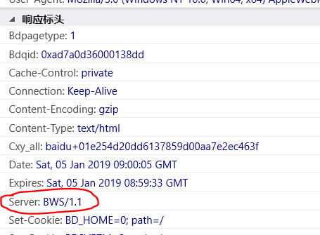

## 要求：
### 1、 用"TEST"+QQ号作为单元测试类名称。 例如QQ：182736 则类名为“TEST182736”，
### 2、 统一package，“com.study.test”
### 3、 本地单元测试通过再进行提交。输出只有一个文件，请勿提交其他无关内容。
### 4、 fork项目，编写完毕后提交合并。 项目地址：
## 题目内容
1. 使用NIO提供的新网络编程工具包，实现访问百度网页(http://www.baidu.com)，获取到百度服务器返回数据的Server:信息。
程序运行输出结果示例：“我的QQ号：12323，我的解析到百度服务器server类型是：Server: BWS/1.1”
浏览器截图的数据示例，我们就是要通过NIO网络请求，拿到这个红色框框的数据并且打印出来
